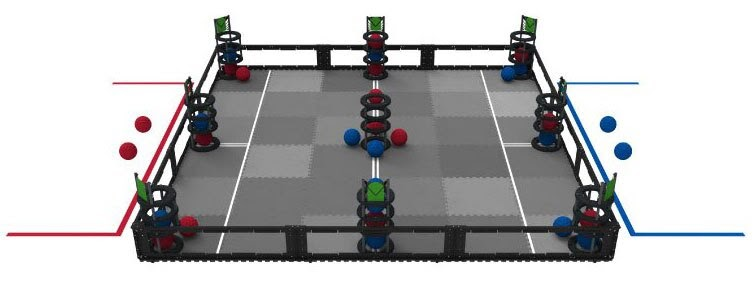

# Change Up Project: Team 1

Team Name: <br/>

Team Members: <br/>
- Brandon Lee 
- Amy Hao
- Matthew Ho
- Alex Rudolph
- Max Shen
- Kelly Lin
- William Huang

## Goal

Our goal for this project was to develop problem solving skills in a team environment. Furthermore, in this project we employed the software development lifecycle and gained hands-on experience with the agile design process.

## How to run

Player vs Player game:
```bash 
make game
game.exe
```

Player vs Computer game:
```bash 
make aigame
aigame.exe
```

## The game



Players take turns adding and removing balls to the gameboard. The gameboard consists of a 3x3 grid of goalposts where balls can be added through the top of the post or removed from the bottom. The first player to get four 3-in-a-rows along any column, row, or diagonal wins. 

## How to play

When prompted you can `add` or `remove` a ball from the board by specifying the post number. A mini board will be displayed with the post numbers.

Add a ball to the board:

```bash
add #
```

Remove a ball from the board:

```bash
remove #
```

Each player can make 3 moves per turn with a maximum of 1 remove per turn. The player going first only gets 2 moves on their first turn.

## How it works

Player class, goalpost class, gameboard class, game class...

## Reinforcement Learning

Train model:
```bash
make train
train.exe
```
